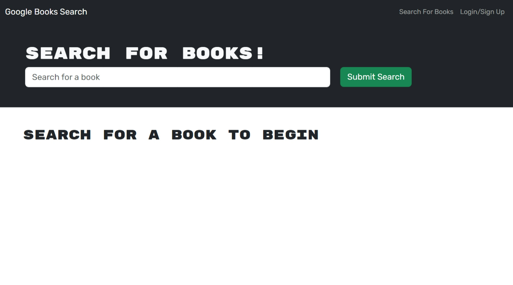

  
  # Book Search Engine

  ## Description

  This is a search application where you can search for new books and add them to your favorites so that you can keep a list to read or buy.   

  ## Table of Contents

  * [Installation](#installation)
  * [Usage](#usage)
  * [Project URL](#project-url)
  * [Project Image](#project-image)
  * [Credits](#credits)
  * [License](#license)
  * [Questions](#questions)
  
  ## Installation

  To run this application on your local machine, follow these steps:

    1. Download the code in your local machine and run `npm install` in the terminal to install all the dependencies.
    2. Start the server by running `npm run develop` in command prompt.
    3. The application starts running at http://localhost:3000/ in the browser.  

  ## Usage

  When you view the application in the browser, you can search for books without logging in. To view your dashboard you have to sign in. If you are a new user you can signup. Once you are logged in you can view the books you have already saved or you can browse new books and add them to your favorites.
  

  ## Project URL

  URL link to the tech-blog webpage:
  (https://saritha-book-search-fa27fe6e3a99.herokuapp.com/).

  ## Project Image
  
  The following image show the web application's appearance and functionality:

  

  ## Credits

  Built this application based on the knowledge gained from bootcamp activities. 

  ## License

  This project is licensed under the MIT license.

  ## Questions

   Check out the code and my other projects at [saritha2708](https://github.com/saritha2708).
   
   If you have any questions reach out to me at [saritha.2708@gmail.com](mailto:saritha.2708@gmail.com).

  